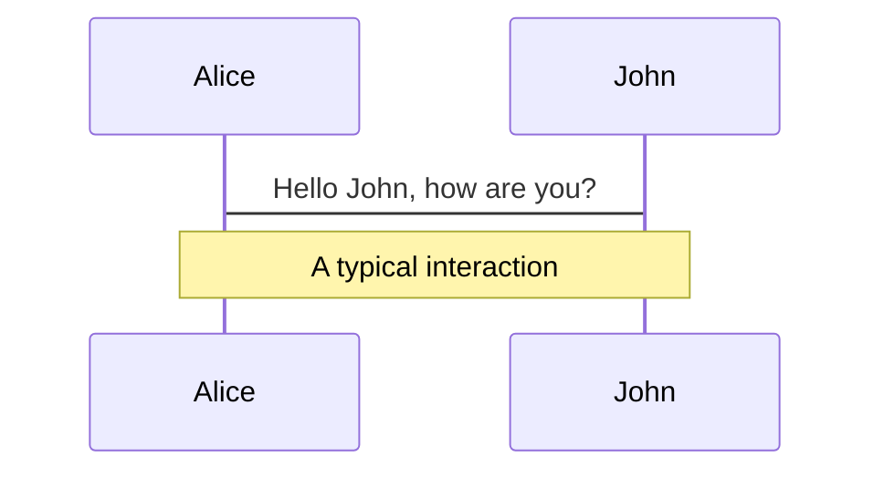
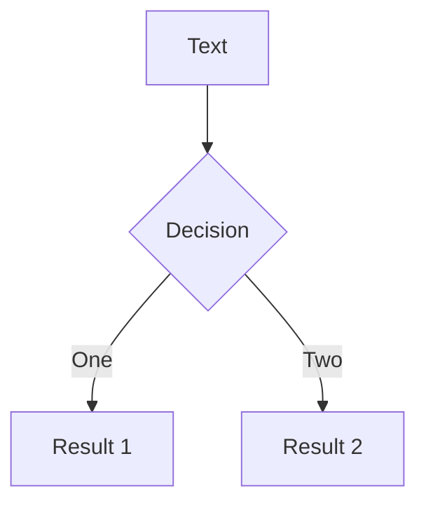

---
# try also 'default' to start simple
theme: seriph
background: https://dashboard.snapcraft.io/site_media/appmedia/2017/06/helm.png
# apply any windi css classes to the current slide
class: 'text-center'
# https://sli.dev/custom/highlighters.html
highlighter: shiki
# some information about the slides, markdown enabled
info: |
  ## Slidev Starter Template
  Presentation slides for developers.

  Learn more at [Sli.dev](https://sli.dev)
---

# Helm

Package Manager for Kubernetes

<div class="pt-12">
  <span @click="$slidev.nav.next" class="px-2 p-1 rounded cursor-pointer" hover="bg-white bg-opacity-10">
    Let's Start <carbon:arrow-right class="inline"/>
  </span>
</div>

<!--
The last comment block of each slide will be treated as slide notes. It will be visible and editable in Presenter Mode along with the slide. [Read more in the docs](https://sli.dev/guide/syntax.html#notes)
-->

---

# What is Helm?

Helm is a Kubernetes package manager

<ul>
  <li v-click=1><b>Install & Uninstall</b> - install and uninstall packages</li>
  <li v-click=2><b>Versioning</b> - Packages versioning management</li>
  <li v-click=3><b>Dependencies</b> - Manage dependencies</li>
</ul>

---

# Terminology

### Chart

Bundled, versioned kubernetes manifests (Python package)

### Helm Client

Interacts with remote repos and K8S cluster in order to manage charts and chart releases (pip)

### Chart Repo

A simple server that stores packaged charts. Those charts can be retrieved by the Helm client ((PyPI))

### Release

An instance of a chart, deployed in K8S

### Release Revision

An update to a current release without installing a new chart version

---

# Chart


<br/>
<br/>
<br/>

```yaml {all|2|3|4|5|all}
# Chart.yaml
apiVersion: v2
name: http-service
version: 0.1.0
dependencies: 
...
```

---

# Helm Template

```yaml {all|1-16|19-22|9|21|11|22|all}
# my-chart/templates/service.yaml
apiVersion: v1
kind: Service
metadata:
  name: {{ .Release.Name }}-svc
  labels:
    {{- include "http-service.labels" . | nindent 4 }}
spec:
  type: {{ .Values.service.type }}
  ports:
    - port: {{ .Values.service.port }}
      targetPort: http
      protocol: TCP
      name: http
  selector:
    {{- include "http-service.selectorLabels" . | nindent 4 }}


# my-chart/values.yaml
service:
  type: ClusterIP
  port: 80
```
---

# Live Demo

```html
<div
  v-motion
  :initial="{ x: -80 }"
  :enter="{ x: 0 }">
  Slidev
</div>
```

<div class="w-60 relative mt-6">
  <div class="relative w-40 h-40">
    
    
    
  </div>

  <div
    class="text-5xl absolute top-14 left-40 text-[#2B90B6] -z-1"
    v-motion
    :initial="{ x: -80, opacity: 0}"
    :enter="{ x: 0, opacity: 1, transition: { delay: 2000, duration: 1000 } }">
    Slidev
  </div>
</div>

<!-- vue script setup scripts can be directly used in markdown, and will only affects current page -->
<script setup lang="ts">
const final = {
  x: 0,
  y: 0,
  rotate: 0,
  scale: 1,
  transition: {
    type: 'spring',
    damping: 10,
    stiffness: 20,
    mass: 2
  }
}
</script>

<div
  v-motion
  :initial="{ x:35, y: 40, opacity: 0}"
  :enter="{ y: 0, opacity: 1, transition: { delay: 3500 } }">

</div>

---


# Diagrams

You can create diagrams / graphs from textual descriptions, directly in your Markdown.

<div class="grid grid-cols-2 gap-10 pt-4 -mb-6">





</div>

[Learn More](https://sli.dev/guide/syntax.html#diagrams)


---
layout: center
class: text-center
---

# Learn More

[Documentations](https://sli.dev) / [GitHub Repo](https://github.com/slidevjs/slidev)
